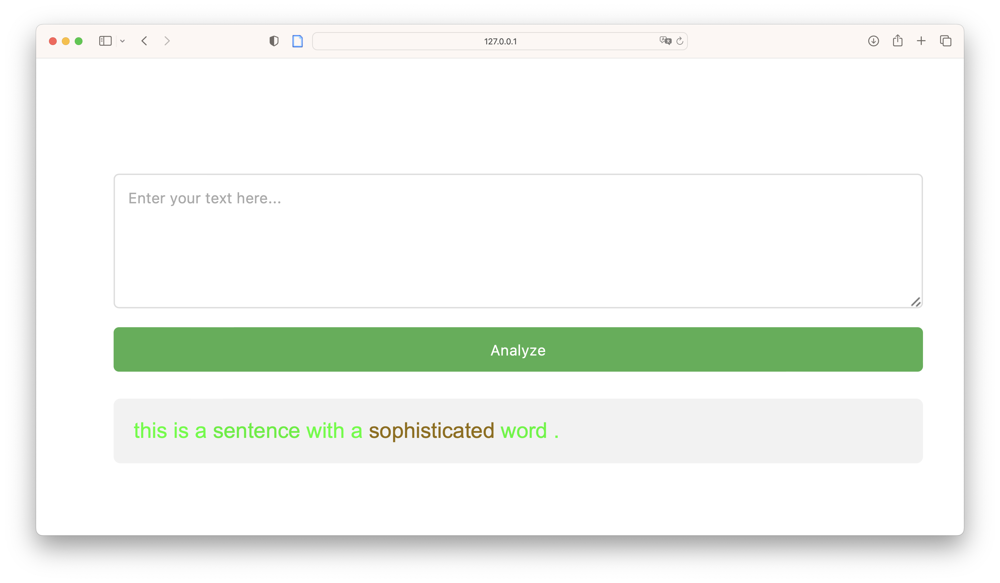

## Sentence Simplification

README following soon.

## Complex Word Identification (CWI)
Simple Project to train and use a CWI pipeline.
### Data
Download the data from [here](https://sites.google.com/view/cwisharedtask2018/datasets) and put it in the `Assignment-Option-3-cwi-datta` folder.
### Training
To train the model, run the following command:
```
python train.py --device <your device>
```
### Testing
To test the model, run the following command:
```
python eval.py --device <your device> --model <path to model> --data_path <path to data>
```
### App
To run the app, run the following command:
```
python app.py --device <your device> --model_path <path to model>
```
Both parameters are optional. If not specified, the app will run on CPU and use the model in the `models` folder.

Here is an example screenshot of the app:


## Simplification
Simple Project that uses the CWI pipeline to simplify a text.
Basemodel is a [T5](https://huggingface.co/humarin/chatgpt_paraphraser_on_T5_base?text=The+toxic+assets+now+total+184+billion+euros%2C+but+many+fear+the+hole+is+even+bigger.).
### Method

## Troubleshooting
The ```.add_adapter``` method is also implemented by guggingface peft library. If you get an error, try to reinstall transformers.
